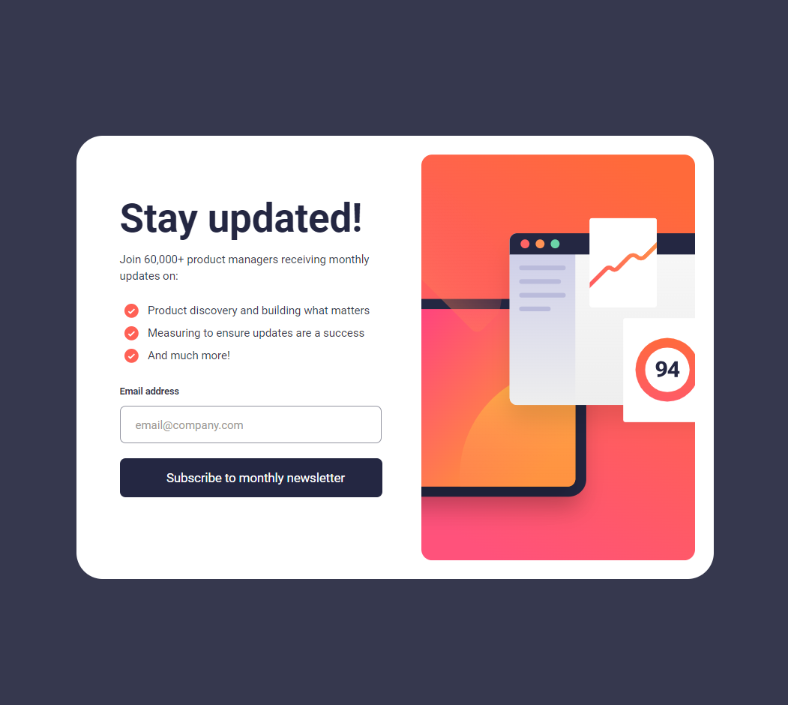

# Frontend Mentor - Newsletter sign-up form with success message solution

This is a solution to the [Newsletter sign-up form with success message challenge on Frontend Mentor](https://www.frontendmentor.io/challenges/newsletter-signup-form-with-success-message-3FC1AZbNrv). Frontend Mentor challenges help you improve your coding skills by building realistic projects. 

## Table of contents

- [Overview](#overview)
  - [The challenge](#the-challenge)
  - [Screenshot](#screenshot)
  - [Links](#links)
  - [Built with](#built-with)
  - [What I learned](#what-i-learned)
  - [Continued development](#continued-development)
  - [Useful resources](#useful-resources)
- [Author](#author)

## Overview

This challenge has helped me practice my skills, I learned a lot and I had a lot of fun. I used HTML, CSS and JavaScript skills for my project.

### The challenge

Users should be able to:

- Add their email and submit the form
- See a success message with their email after successfully submitting the form
- See form validation messages if:
  - The field is left empty
  - The email address is not formatted correctly
- View the optimal layout for the interface depending on their device's screen size
- See hover and focus states for all interactive elements on the page

### Screenshot

### Links

- Solution URL: [Add solution URL here](https://www.frontendmentor.io/solutions/newsletter-sign-up-form-with-success-message-solution-mMsSp2CLkP)
- Live Site URL: (https://spzondo.github.io/newsletter-sign-up/)

### Built with

- Semantic HTML5 markup
- CSS 
- JavaScript

### What I learned

-I learned form validation  and using javaScript for checking email address input and format. 

-I also had a lot of practice with responsive web design

### Continued development

I would like to focus more on media queries in future projects. I found media quieries to be the most challenging aspect of the project. 

### Useful resources

- [W3 Schools](https://www.w3schools.com) - This helped me with media quieres. I really liked the examples they give, it makes understanding a lot easier 

## Author

- Frontend Mentor - [@SPZONDO](https://www.frontendmentor.io/profile/SPZONDO)

